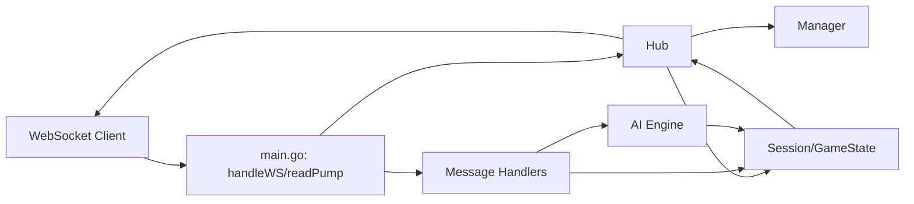
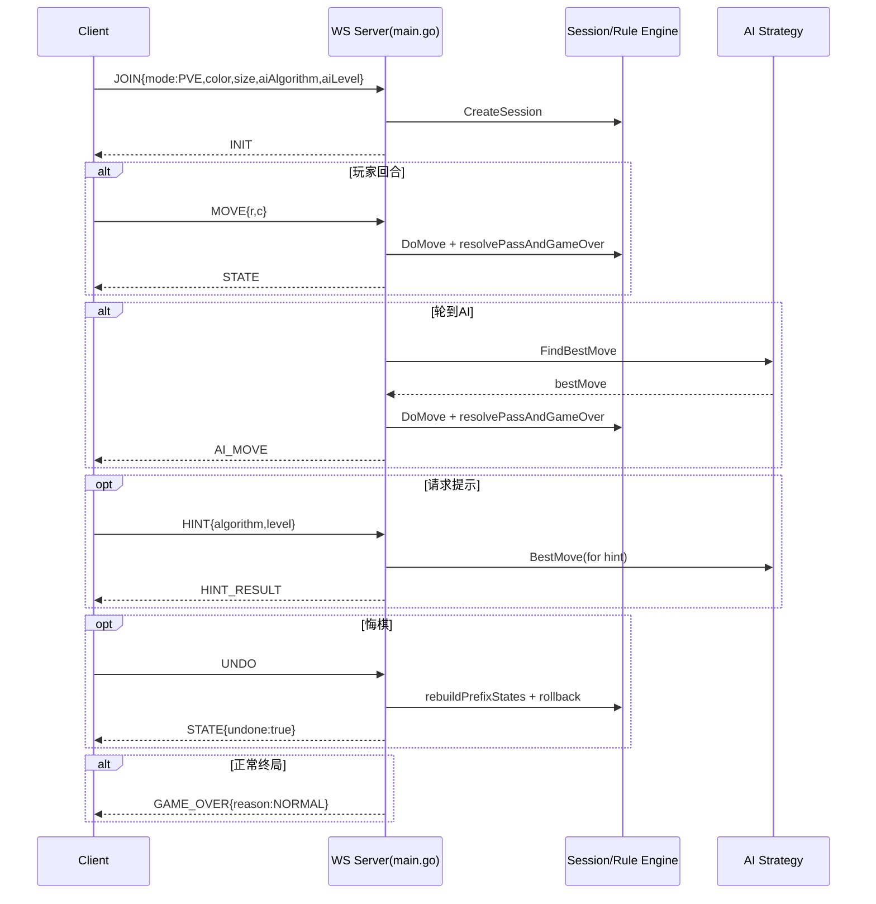
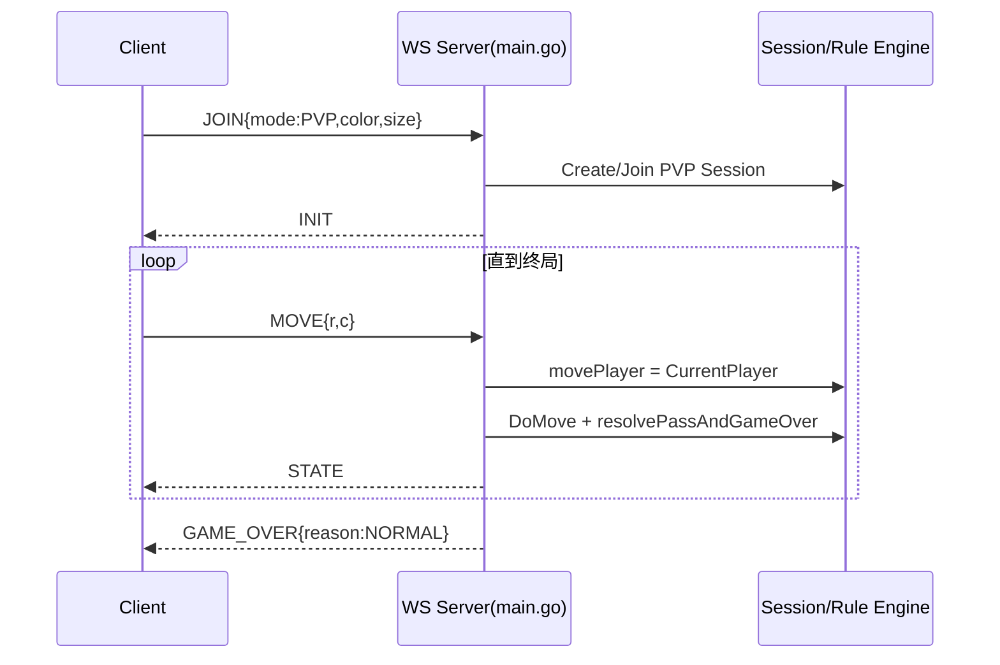
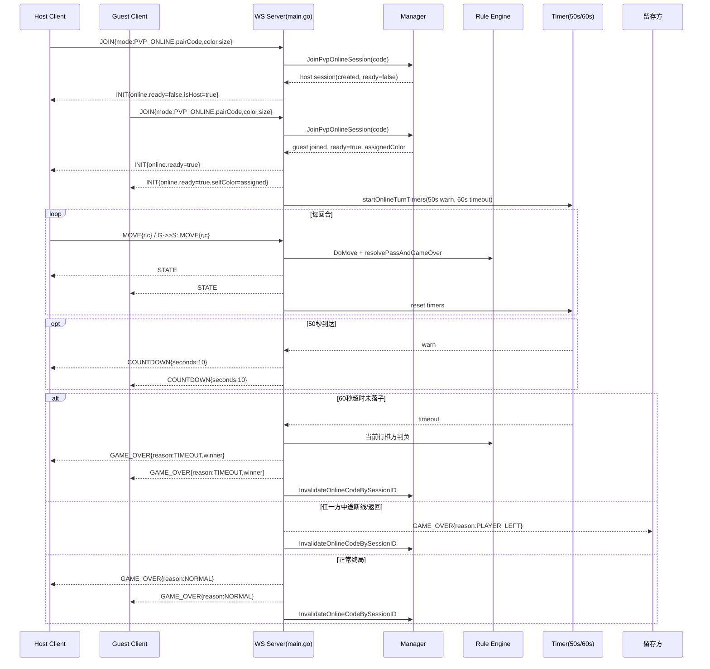
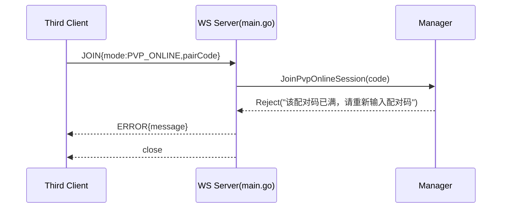
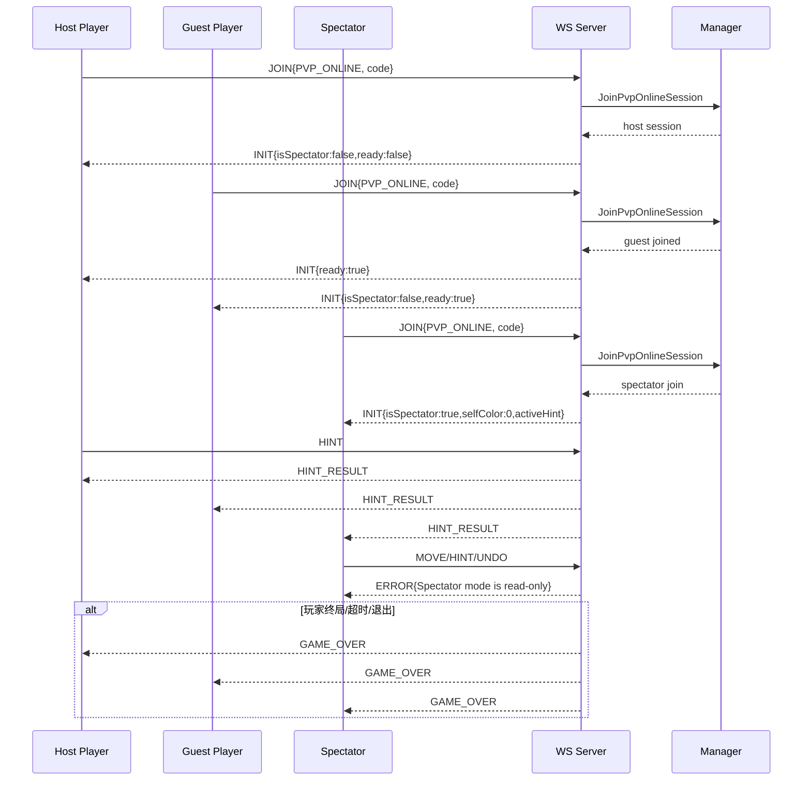

# Othello 后端程序设计书

## 1. 文档范围
本文档描述 `backend` 服务端实现，覆盖：
- 整体架构
- 模块划分与职责
- 模块间关系
- 通讯接口（WebSocket）
- 通讯协议（消息类型、字段、约束）
- 关键流程（PVE / 本地PVP / 在线PVP）

代码基线目录：`backend/`

---

## 2. 整体架构

后端采用 **单进程 Go WebSocket 服务** 架构：
- 入口：`main.go`
- 游戏域：`game/*`
- 通讯：`gorilla/websocket`

逻辑分层：
1. 接入层（WS 协议解析、连接生命周期）
2. 会话层（Hub + Session 管理、广播、超时计时）
3. 规则层（棋盘规则、落子翻转、可落子、终局）
4. 策略层（AI算法工厂与具体策略）

---

## 3. 模块构成

### 3.1 `main.go`（接入与编排）
职责：
- 启动 HTTP 服务并注册 `/ws/game`
- 管理连接集合（`Hub.Clients`）
- 会话注册/反注册（`Register` / `Unregister`）
- 处理消息分发：`JOIN` / `MOVE` / `HINT` / `UNDO` / `PING`
- 在线对局计时：50 秒预警、60 秒超时判负
- 广播状态与终局消息

关键结构：
- `WSMessage{ type, data }`
- `Client{ Conn, Session, Color, IsHost }`
- `Hub{ Clients, Manager, turnTimers, warnTimers }`

### 3.2 `game/state.go`（状态模型）
职责：
- 定义核心数据结构：`Player`、`Position`、`Move`、`GameState`
- 初始化棋盘：`NewGameState(size)`
- 拷贝状态：`Clone()`
- 计分：`Score()`

### 3.3 `game/engine.go`（规则引擎）
职责：
- 规则计算：`GetFlips`、`ValidMoves`
- 落子执行：`DoMove`
- 尝试落子+Pass逻辑：`TryMove`

### 3.4 `game/manager.go`（会话管理）
职责：
- 创建/查询/删除会话
- 支持三种模式：`PVE`、`PVP`、`PVP_ONLINE`
- 在线配对码索引：`pvpOnlineByCode`
- 在线配对逻辑：`JoinPvpOnlineSession`
- 终局后配对码失效：`InvalidateOnlineCodeBySessionID`

### 3.5 `game/ai*.go`（AI策略）
职责：
- AI接口：`AIStrategy`
- 工厂：`AIStrategyFactory`
- 策略实现：
  - `enhancedABStrategy`
  - `pvsStrategy`
  - `mctsStrategy`
  - `hybridStrategy`
- 提示引擎：`NewHintEngine`

---

## 4. 模块关系



关系说明：
- `main.go` 是编排中心，不直接持久化数据。
- `Manager` 负责会话元数据；`GameState` 负责棋局数据。
- 每个会话有自己的 `Mutex`，用于串行化该会话内状态修改。
- `Hub` 负责同会话内广播和在线对局计时器。

---

## 5. 通讯接口

### 5.1 接口定义
- 协议：WebSocket
- 路径：`/ws/game`
- 首帧要求：客户端第一条消息必须是 `JOIN`

### 5.2 消息封装
统一信封：
```json
{
  "type": "MESSAGE_TYPE",
  "data": { }
}
```

---

## 6. 通讯协议

## 6.1 客户端 -> 服务端

### JOIN
用途：创建/加入对局。

字段：
- `mode`: `PVE | PVP | PVP_ONLINE`
- `color`: `BLACK | WHITE`
- `size`: `6 | 8 | 10`
- `gameId`: (PVP 可选)
- `pairCode`: (PVP_ONLINE 必填，4位数字)
- `aiAlgorithm`: (PVE/提示)
- `aiLevel`: `easy|normal|hard`

### MOVE
字段：
- `r`: 行索引（0-based）
- `c`: 列索引（0-based）

### HINT
字段：
- `algorithm`
- `level`

### UNDO
- 无字段
- 仅 PVE 可用

### PING
- 心跳包

## 6.2 服务端 -> 客户端

### INIT
用途：入局初始状态。

字段：
- `gameId`
- `board`
- `currentPlayer`
- `selfColor`
- `size`
- `history`
- `players.BLACK/WHITE`
- `aiSettings`
- `hintSettings`
- `online`（仅在线模式）
  - `pairCode`
  - `isHost`
  - `ready`

### STATE
用途：常规状态推进（落子/Pass/悔棋）。

字段（按场景部分出现）：
- `board`
- `currentPlayer`
- `history`
- `lastMove`
- `flipped`
- `pass`
- `undone`

### AI_MOVE
用途：PVE 中 AI 完成一步。

字段：
- `r`,`c`
- `flipped`
- `board`
- `history`
- `currentPlayer`

### HINT_RESULT
字段：
- `position`（可空）
- `algorithm{name,code}`
- `level`

### COUNTDOWN
用途：在线模式 50 秒触发倒计时提示。

字段：
- `seconds`（当前实现为 10）

### GAME_OVER
字段：
- `winner`: `BLACK | WHITE | DRAW`
- `blackScore`
- `whiteScore`
- `reason`: `NORMAL | TIMEOUT | PLAYER_LEFT`
- `message`（非 NORMAL 场景常用）

### ERROR
字段：
- `message`

### PONG
- 对 `PING` 的响应

---

## 7. 模式行为定义

## 7.1 PVE（人机）
- 会话创建即 `Ready=true`
- 玩家落子后，若轮到 AI，服务端计算并广播 `AI_MOVE`
- 支持 `UNDO`（回退到玩家回合快照）

## 7.2 PVP（本地双人）
- 单连接可轮流操作黑白
- `MOVE` 执行方按 `CurrentPlayer` 决定

## 7.3 PVP_ONLINE（在线双人）
- 4位配对码匹配两名玩家
- 首个加入者为 host，决定颜色和棋盘
- 第二名加入后 `ready=true`，双方收到更新 `INIT`
- 第三名同码加入返回 `ERROR`
- 任一方断线：`GAME_OVER(reason=PLAYER_LEFT)`
- 超时规则：
  - 50秒发 `COUNTDOWN(10)`
  - 60秒未落子：当前行棋方判负，`reason=TIMEOUT`
- 终局后配对码立即失效，可被再次复用开新局

---

## 8. 并发与一致性

- `Hub.mu`：保护连接集合与计时器字典。
- `Session.Mutex`：保护单局状态读写。
- 所有落子、提示、悔棋等状态变更在会话锁内执行。
- AI计算前会短暂释放会话锁，避免阻塞。

---

## 9. 错误处理与约束

- 非 `JOIN` 首帧：拒绝连接。
- 无效模式/尺寸：回落默认值（模式默认 PVE，尺寸默认 8）。
- 非法落子/非当前回合：返回 `ERROR`。
- 在线模式未就绪前（对手未加入）：拒绝业务消息。

---

## 10. 可扩展建议

1. 增加 HTTP 健康检查（`/healthz`）方便脚本判断后端就绪。
2. 将 WS 协议字段抽离为单独 schema 文档（JSON Schema / protobuf）。
3. 为 `manager.go` 与 `main.go` 补单元测试（配对、超时、断线、悔棋）。
4. 引入会话过期回收机制，降低长期运行内存占用。

---

## 11. 接口时序图（按消息顺序）

### 11.1 PVE 对局时序



### 11.2 本地双人 PVP 时序（单客户端双执子）



### 11.3 在线双人 PVP_ONLINE 时序（配对码）



### 11.4 在线配对码满员（第三人）时序



---

## 12. 模块设计细化（函数级）

> 本章节补充第 3 章，按“结构体 + 成员作用 + 函数职责/输入输出/副作用”展开。

### 12.1 `main.go`

#### 12.1.1 结构体

### `type WSMessage struct`
- `Type string`：消息类型标识。
- `Data json.RawMessage`：消息体原始 JSON，按 `Type` 再反序列化。

### `type Client struct`
- `Conn *websocket.Conn`：当前客户端 WS 连接。
- `Session *game.Session`：所属对局会话。
- `Color game.Player`：该连接代表的执子颜色（在线模式由服务端分配后回传）。
- `IsHost bool`：在线模式下是否主玩家（首个入码者）。
- `Send chan []byte`：预留发送通道（当前主要走 `SendJSON` 直接发送）。
- `mu sync.Mutex`：保护单连接写操作，避免并发写 socket。

### `type Hub struct`
- `Clients map[string]*Client`：在线连接表，键为 `sessionID-color`。
- `turnTimers map[string]*time.Timer`：在线模式 60 秒超时计时器（按 sessionID）。
- `warnTimers map[string]*time.Timer`：在线模式 50 秒预警计时器（按 sessionID）。
- `mu sync.RWMutex`：保护 `Clients/turnTimers/warnTimers`。
- `Manager *game.Manager`：会话管理器。
- `Register chan *Client`：注册连接事件通道。
- `Unregister chan *Client`：反注册连接事件通道。

#### 12.1.2 函数

### `NewHub(m *game.Manager) *Hub`
- 功能：初始化 Hub 实例和内部 map/channel。
- 输入：`Manager`。
- 输出：`*Hub`。
- 副作用：无。

### `(h *Hub) Run()`
- 功能：事件循环，处理注册/反注册。
- 行为：
  - 注册：写入 `Clients` 并发送 `INIT`。
  - 反注册：删除 `Clients` 并触发在线断线逻辑。
- 副作用：会改写连接表、可能触发终局广播。

### `(h *Hub) sendInit(client *Client)`
- 功能：构造并发送 `INIT`。
- 关键点：
  - 含 `selfColor`，前端据此修正自身执子。
  - 在线模式附加 `online{pairCode,isHost,ready}`。

### `(h *Hub) refreshOnlineInit(sessionID string)`
- 功能：在线第二人加入后，对同会话所有连接重发 `INIT`，同步 `ready/selfColor`。

### `playerLabel(s *game.Session, p game.Player) string`
- 功能：返回黑白方展示名称。

### `(h *Hub) stopOnlineTurnTimers(sessionID string)`
- 功能：停止并清理指定会话的 50s/60s 计时器。

### `(h *Hub) startOnlineTurnTimers(sessionID string)`
- 功能：在线模式启动新一轮计时。
- 行为：
  - 50 秒时广播 `COUNTDOWN{seconds:10}`。
  - 60 秒时：当前行棋方判负，广播 `GAME_OVER{reason:TIMEOUT}`，并失效配对码。

### `(h *Hub) handleDisconnect(client *Client)`
- 功能：在线模式断线处理。
- 行为：将对局置 `GameOver`，广播 `PLAYER_LEFT` 终局，清计时器并失效配对码。

### `(h *Hub) Broadcast(session *game.GameState, sender *Client, msg WSMessage)`
- 功能：向同 session 的所有在线连接广播。

### `(c *Client) SendJSON(msg WSMessage)`
- 功能：序列化并发送单条 WS 消息。
- 并发：连接级 mutex 保证写串行。

### `handleWS(hub *Hub, w http.ResponseWriter, r *http.Request)`
- 功能：WS 升级与首帧 `JOIN` 鉴别。
- 行为：
  - 解析 `JOIN`。
  - 按模式调用 `Manager` 创建/加入会话。
  - 在线模式下做 4 位数字配对码校验。
  - 启动读写协程。

### `(c *Client) readPump(hub *Hub)`
- 功能：读取客户端消息并分发。

### `(c *Client) writePump()`
- 功能：发送通道消费（当前预留）。

### `(c *Client) handleMessage(hub *Hub, msg WSMessage)`
- 功能：统一消息入口。
- 规则：
  - 在线模式未 ready 时（除 PING）拒绝业务消息。
  - 已终局时拒绝所有业务消息。

### `(c *Client) handleMove(hub *Hub, data json.RawMessage)`
- 功能：处理落子。
- 模式差异：
  - PVP：落子方按 `CurrentPlayer`（单客户端黑白轮流）。
  - PVP_ONLINE/PVE：按 `c.Color`。
- 副作用：更新棋局、广播 `STATE`、可能触发 pass/终局/在线计时重置/AI走子。

### `(c *Client) handleUndo(hub *Hub)`
- 功能：PVE 悔棋。
- 实现：重建历史前缀状态，回退到玩家可操作状态。

### `(c *Client) handleHint(data json.RawMessage)`
- 功能：计算提示点。
- 模式差异：
  - PVP：提示当前行棋方。
  - 其他：提示 `c.Color`。

### `(c *Client) runAIMoveIfNeeded(hub *Hub)`
- 功能：PVE AI 自动走子循环。
- 细节：AI 思考前短暂释放会话锁，避免长期占锁。

### `(c *Client) resolvePassAndGameOver(hub *Hub) bool`
- 功能：处理“无合法落子必须 pass”与“双方均无子可下终局”。

### `buildPrefixStates(size int, history []game.Move) []*game.GameState`
- 功能：按历史重放生成前缀快照，用于悔棋。

### `(c *Client) handleGameOver(hub *Hub)`
- 功能：正常终局计分与广播 `GAME_OVER{reason:NORMAL}`。
- 在线附加：停止计时器、失效配对码。

### `mustMarshal(v any) json.RawMessage`
- 功能：安全 JSON 序列化。

### `(c *Client) remoteAddr/sessionID/colorLabel`
- 功能：日志辅助。

### `main()`
- 功能：创建 `Manager/Hub` 并启动 HTTP 服务。

---

### 12.2 `game/state.go`

#### 12.2.1 结构体

### `type Player int`
- 枚举：`EMPTY(0)/BLACK(1)/WHITE(2)`。

### `type Position struct`
- `R int`：行。
- `C int`：列。

### `type Move struct`
- `Player Player`：落子方。
- `Position *Position`：落子位置；`nil` 表示 pass。
- `Flipped []Position`：本步翻转列表。
- `HintTag string`：提示命中标签（可选）。

### `type GameState struct`
- `Board [][]Player`：棋盘矩阵。
- `CurrentPlayer Player`：当前行棋方。
- `Size int`：边长。
- `History []Move`：历史。
- `GameOver bool`：终局标记。

#### 12.2.2 函数
- `Opponent() Player`：返回对手颜色。
- `String() string`：枚举转字符串。
- `NewGameState(size int) *GameState`：初始化四子开局。
- `Clone() *GameState`：深拷贝。
- `Score() (black, white int)`：计分。

---

### 12.3 `game/engine.go`

#### 12.3.1 函数
- `inBounds(r,c,size)`：边界判断。
- `GetFlips(r,c,player)`：返回该点落子可翻转的全部棋子。
- `ValidMoves(player)`：返回合法落子映射 `"r,c" -> flips`。
- `DoMove(r,c,player)`：执行落子并落历史。
  - 返回：`([]Position, bool)` = 翻转列表、是否合法。
- `TryMove(r,c,player)`：尝试落子并处理 pass/终局（当前主流程主要使用 `DoMove + resolvePassAndGameOver`）。
- `posKey/itoa`：位置键生成与数字转字串。

---

### 12.4 `game/manager.go`

#### 12.4.1 结构体

### `type Session struct`
- `ID string`：会话唯一标识。
- `Mode GameMode`：`PVE/PVP/PVP_ONLINE`。
- `PairCode string`：在线配对码（仅在线模式）。
- `State *GameState`：棋局状态。
- `Players map[Player]string`：颜色到玩家标识（当前主要用于展示占位）。
- `AI *AI`：PVE AI 实例。
- `Ready bool`：PVP/PVP_ONLINE 双方是否就绪。
- `Mutex sync.Mutex`：会话级并发锁。
- `AISettings AISettings`：会话 AI 配置。
- `HintSettings map[Player]HintSettings`：每方提示配置。
- `LastHint map[Player]*Position`：每方最近提示位置（用于命中标记）。

### `type Manager struct`
- `sessions map[string]*Session`：会话表。
- `pvpOnlineByCode map[string]string`：配对码 -> sessionID 映射。
- `mu sync.RWMutex`：管理器读写锁。

### `type AISettings / HintSettings`
- `Algorithm AIAlgorithmName`：算法名。
- `Level AILevel`：难度等级。

### `type OnlineJoinResult`
- `Session *Session`：命中的会话。
- `IsHost bool`：是否主玩家。
- `AssignedColor Player`：服务端最终分配颜色。
- `Reject string`：拒绝原因（非空即失败）。

#### 12.4.2 函数
- `NewManager()`：初始化管理器。
- `CreateSession(...)`：创建会话（PVE时绑定AI并置Ready）。
- `JoinPvpSession(...)`：本地PVP加入或新建。
- `JoinPvpOnlineSession(...)`：在线配对。
  - 首人：建会话、`ready=false`、记录配对码。
  - 次人：加入同码会话、分配颜色、`ready=true`。
  - 第三人：返回 `Reject`。
- `GetSession(id)`：按 ID 获取。
- `DeleteSession(id)`：删除会话并清理配对码映射。
- `InvalidateOnlineCodeBySessionID(id)`：终局后使配对码失效。

---

### 12.5 `game/ai*.go`

#### 12.5.1 结构体与成员

### `type AI struct`
- `Color Player`：AI执子。
- `Algorithm AIAlgorithmName`：算法名。
- `Level AILevel`：难度。
- `strategy AIStrategy`：策略实现。

### `type AIProfile`
- `Name AIAlgorithmName`：算法展示名。
- `Code string`：算法短码（历史标识用）。

### `type AIStrategyFactory`
- `size int`：棋盘大小。

### 具体策略结构体
- `enhancedABStrategy{base *searchStrategy}`
- `pvsStrategy{base *searchStrategy}`
- `mctsStrategy{base *searchStrategy, rng *rand.Rand}`
- `hybridStrategy{base *searchStrategy}`

#### 12.5.2 函数
- `ParseAlgorithmName/ParseLevel`：入参规范化。
- `AlgorithmProfile`：算法元信息查询。
- `NewAI(...)`：创建 AI 与策略。
- `(ai *AI) FindBestMove(gs)`：AI找最优步。
- `NewHintEngine(...)`：提示策略实例。
- `NewAIStrategyFactory/Create`：策略工厂。
- 各策略 `BestMove`：算法入口。

---

## 13. 通讯协议电文实例（场景化）

> 说明：以下均为 JSON 文本示例，字段顺序可不固定。

### 13.1 入局（JOIN）

### 13.1.1 PVE
```json
{"type":"JOIN","data":{"mode":"PVE","color":"BLACK","size":8,"aiAlgorithm":"增强博弈","aiLevel":"normal"}}
```

### 13.1.2 本地PVP
```json
{"type":"JOIN","data":{"mode":"PVP","color":"WHITE","size":8}}
```

### 13.1.3 在线PVP（主玩家）
```json
{"type":"JOIN","data":{"mode":"PVP_ONLINE","color":"BLACK","size":8,"pairCode":"1234"}}
```

### 13.1.4 在线PVP（客玩家）
```json
{"type":"JOIN","data":{"mode":"PVP_ONLINE","color":"WHITE","size":8,"pairCode":"1234"}}
```

---

### 13.2 INIT 响应

### 13.2.1 在线主玩家未就绪
```json
{
  "type":"INIT",
  "data":{
    "gameId":"d2b4...",
    "board":[[0,0,0,0,0,0,0,0],"..."],
    "currentPlayer":1,
    "selfColor":1,
    "size":8,
    "history":[],
    "players":{"BLACK":"黑棋","WHITE":"白棋"},
    "aiSettings":{"algorithm":"增强博弈","level":"normal"},
    "hintSettings":{"algorithm":"增强博弈","level":"normal"},
    "online":{"pairCode":"1234","isHost":true,"ready":false}
  }
}
```

### 13.2.2 在线双方就绪后（客玩家）
```json
{
  "type":"INIT",
  "data":{
    "gameId":"d2b4...",
    "currentPlayer":1,
    "selfColor":2,
    "size":8,
    "online":{"pairCode":"1234","isHost":false,"ready":true}
  }
}
```

---

### 13.3 落子与状态推进

### 13.3.1 MOVE 请求
```json
{"type":"MOVE","data":{"r":2,"c":3}}
```

### 13.3.2 STATE（普通落子）
```json
{
  "type":"STATE",
  "data":{
    "board":[[0,0,0,0,0,0,0,0],"..."],
    "currentPlayer":2,
    "lastMove":{"r":2,"c":3},
    "flipped":[{"r":3,"c":3}],
    "history":[{"player":1,"position":{"r":2,"c":3},"flipped":[{"r":3,"c":3}]}]
  }
}
```

### 13.3.3 STATE（pass）
```json
{
  "type":"STATE",
  "data":{
    "board":[["..."],"..."],
    "currentPlayer":1,
    "pass":true,
    "history":[{"player":2,"position":null,"flipped":null}]
  }
}
```

### 13.3.4 STATE（悔棋）
```json
{
  "type":"STATE",
  "data":{
    "board":[["..."],"..."],
    "currentPlayer":1,
    "history":["..."],
    "undone":true
  }
}
```

---

### 13.4 AI 与提示

### 13.4.1 AI_MOVE
```json
{
  "type":"AI_MOVE",
  "data":{
    "r":4,
    "c":5,
    "flipped":[{"r":4,"c":4}],
    "board":[["..."],"..."],
    "history":["..."],
    "currentPlayer":1
  }
}
```

### 13.4.2 HINT 请求
```json
{"type":"HINT","data":{"algorithm":"主线剪枝","level":"hard"}}
```

### 13.4.3 HINT_RESULT
```json
{
  "type":"HINT_RESULT",
  "data":{
    "position":{"r":2,"c":4},
    "algorithm":{"name":"主线剪枝","code":"pvs"},
    "level":"hard"
  }
}
```

---

### 13.5 在线计时相关

### 13.5.1 COUNTDOWN（50秒触发）
```json
{"type":"COUNTDOWN","data":{"seconds":10}}
```

### 13.5.2 GAME_OVER（超时判负）
```json
{
  "type":"GAME_OVER",
  "data":{
    "winner":"WHITE",
    "blackScore":22,
    "whiteScore":26,
    "reason":"TIMEOUT",
    "message":"超时判负，对局结束"
  }
}
```

### 13.5.3 GAME_OVER（玩家退出）
```json
{
  "type":"GAME_OVER",
  "data":{
    "winner":"DRAW",
    "blackScore":18,
    "whiteScore":17,
    "reason":"PLAYER_LEFT",
    "message":"有玩家中途退出，对局结束"
  }
}
```

### 13.5.4 GAME_OVER（正常终局）
```json
{
  "type":"GAME_OVER",
  "data":{
    "winner":"BLACK",
    "blackScore":36,
    "whiteScore":28,
    "reason":"NORMAL"
  }
}
```

---

### 13.6 错误电文

### 13.6.1 首帧不是 JOIN
```json
{"type":"ERROR","data":{"message":"First message must be JOIN"}}
```

### 13.6.2 在线配对码非法（非4位数字）
```json
{"type":"ERROR","data":{"message":"配对码必须为4位数字"}}
```

### 13.6.3 在线配对码满员（第三人）
```json
{"type":"ERROR","data":{"message":"该配对码已满，请重新输入配对码"}}
```

### 13.6.4 未轮到该玩家
```json
{"type":"ERROR","data":{"message":"Not your turn"}}
```

### 13.6.5 非法落子
```json
{"type":"ERROR","data":{"message":"Invalid move"}}
```

### 13.6.6 在线未就绪前发送业务消息
```json
{"type":"ERROR","data":{"message":"等待对手加入后开始游戏"}}
```

### 13.6.7 终局后继续操作
```json
{"type":"ERROR","data":{"message":"Game is over"}}
```

---

### 13.7 心跳

### 13.7.1 PING
```json
{"type":"PING"}
```

### 13.7.2 PONG
```json
{"type":"PONG"}
```

---

## 14. 会话（Session）专题说明

本项目中的“会话”是后端对“一局对弈上下文”的统一抽象。它不是 HTTP Session，也不是账号登录会话，而是**对局会话**。

### 14.1 什么是会话

会话对应 `game.Session` 结构体实例，代表一局棋从创建到结束的全部运行上下文，包含：
- 棋局状态（棋盘、当前手、历史、是否终局）
- 对局模式（PVE / PVP / PVP_ONLINE）
- 参与方信息（颜色占用、在线模式主客关系）
- AI与提示配置
- 并发控制锁（会话内串行化）

简化理解：**会话 = 一局棋 + 这局棋的控制面**。

### 14.2 会话的作用

会话用于解决以下核心问题：
1. 隔离性：不同对局互不影响。
2. 一致性：同一对局内状态读写受同一把 `Session.Mutex` 保护。
3. 可路由：通过 `sessionID` 将广播消息发给正确玩家。
4. 可追踪：历史、提示命中、超时计时等附着在会话上。
5. 可治理：在线配对码与会话绑定，终局后可统一失效。

### 14.3 会话的数据结构（表现形式）

代码定义：`backend/game/manager.go` 的 `type Session struct`。

成员与作用：
- `ID string`：会话唯一标识（UUID）。
- `Mode GameMode`：对局模式。
- `PairCode string`：在线配对码（仅在线模式有意义）。
- `State *GameState`：棋局状态对象。
- `Players map[Player]string`：颜色占用/标记。
- `AI *AI`：PVE 的 AI 实例。
- `Ready bool`：对局是否就绪。
  - PVE：创建即 `true`
  - PVP/PVP_ONLINE：等待双方进入后为 `true`
- `Mutex sync.Mutex`：会话内并发锁。
- `AISettings AISettings`：AI算法与等级。
- `HintSettings map[Player]HintSettings`：每方提示算法与等级。
- `LastHint map[Player]*Position`：每方最近提示落点（用于历史标签）。

### 14.4 会话是如何生成的

入口在 `handleWS`，首帧 `JOIN` 后按模式分流：

1. PVE：`Manager.CreateSession(...)`
- 生成 `sessionID(uuid)`
- 初始化 `GameState`
- 创建 `AI`
- `Ready=true`

2. 本地 PVP：`Manager.JoinPvpSession(...)`
- 若带 `gameId` 且存在未就绪会话则加入
- 否则创建新会话
- 通常用于“同一局双连接”或“单连接双执子”场景

3. 在线 PVP：`Manager.JoinPvpOnlineSession(pairCode,...)`
- 若 `pairCode` 尚无会话：创建会话，加入者为主玩家，`Ready=false`
- 若已有同码未满会话：作为客玩家加入，服务端分配颜色，`Ready=true`
- 若同码已满（黑白均占）：返回 `Reject`，客户端收到 `ERROR`

### 14.5 会话是如何管理的

管理器：`type Manager`。

核心索引：
- `sessions map[string]*Session`：主索引，按 `sessionID` 管理。
- `pvpOnlineByCode map[string]string`：在线索引，`pairCode -> sessionID`。

核心操作：
- `CreateSession`：新建并入 `sessions`。
- `GetSession`：按 ID 读。
- `DeleteSession`：删会话并清理配对码索引。
- `InvalidateOnlineCodeBySessionID`：仅清配对码映射，保留会话对象（便于终局数据继续下发）。

并发策略：
- `Manager.mu`：保护全局索引增删改查。
- `Session.Mutex`：保护单局状态推进。

### 14.6 会话与连接的关系

连接实体：`Client`，包含 `Session *game.Session`。

关系特征：
- 一个会话可绑定 1~2 个活动连接（在线模式最多2个）。
- `Hub.Clients` 键为 `sessionID-color`。
- 广播时按 `sessionID` 过滤，实现会话内广播。

### 14.7 会话的生命周期

典型状态流：

1. 创建（Created）
- 完成会话对象初始化，进入 `sessions`。

2. 等待配对/就绪（Waiting/Ready）
- PVE 直接就绪。
- 在线模式首人进入后 `ready=false`，次人加入后 `ready=true`。

3. 进行中（Running）
- 接收 `MOVE/HINT/UNDO`（UNDO仅PVE）
- 更新棋盘、历史、回合
- 在线模式启动并循环重置 50/60 秒计时

4. 终局（GameOver）
- 正常终局：双方都无合法步
- 异常终局：超时判负 / 玩家中途退出
- 广播 `GAME_OVER`

5. 失效/清理（Invalidated/Cleanup）
- 在线模式：失效配对码映射，允许同码重开新局
- 会话对象目前以内存保留，未做自动回收（可扩展）

### 14.8 会话的结束条件

会话“逻辑结束”条件：
1. 规则终局：双方均无子可下。
2. 在线超时：60 秒未落子（当前行棋方判负）。
3. 在线断线：任一方退出/连接断开。

对应行为：
- `State.GameOver = true`
- 广播 `GAME_OVER`
- 在线模式停止计时器
- 在线模式失效配对码

### 14.9 会话在协议中的表现形式

会话并不直接整体下发，而通过多个字段体现：
- `INIT.data.gameId`：会话标识
- `INIT.data.online{pairCode,isHost,ready}`：在线会话元信息
- `STATE/AI_MOVE/GAME_OVER`：会话状态演进快照

客户端侧不需要持有完整会话对象，只需根据协议字段维护 UI 状态。

### 14.10 当前实现边界与建议

当前边界：
- 会话保存在进程内存，服务重启后丢失。
- 未实现会话自动过期回收。
- 未做跨节点共享（单实例部署）。

建议扩展：
1. 增加会话 TTL 与后台清理协程。
2. 增加 `SessionStatus` 显式枚举（Created/Ready/Running/Ended）。
3. 将会话索引持久化到 Redis 以支持多实例在线匹配。
4. 新增管理接口（会话查询/回收）用于运维与观测。

---

## 15. AI 算法管理与统一接口设计

本章节说明：AI 算法如何在系统中被管理、如何切换、如何通过统一接口对外服务。

### 15.1 设计目标

AI 子系统设计目标：
1. 多算法可插拔：增强博弈 / 主线剪枝 / 蒙特树搜 / 混合博弈。
2. 统一调用入口：业务层不关心算法细节。
3. 会话内配置稳定：PVE 开局后 AI 配置不被提示功能污染。
4. 提示与对局解耦：HINT 可独立选算法，不改变对局 AI。

### 15.2 算法枚举与元数据管理

定义位置：`backend/game/ai.go`

核心类型：
- `type AIAlgorithmName string`
- `type AILevel string`
- `type AIProfile struct { Name, Code }`

当前算法常量：
- `AlgorithmEnhanced`（增强博弈）
- `AlgorithmPVS`（主线剪枝）
- `AlgorithmMCTS`（蒙特树搜）
- `AlgorithmHybrid`（混合博弈）

元数据字典：`algorithmProfiles map[AIAlgorithmName]AIProfile`
- 作用：
  - 提供前后端统一算法标识
  - 提供短码（如 `abx/pvs/mcts/mix`）用于历史与展示

规范化函数：
- `ParseAlgorithmName(name string) AIAlgorithmName`
  - 非法值回落到 `AlgorithmEnhanced`
- `ParseLevel(level string) AILevel`
  - 非法值回落到 `LevelNormal`

### 15.3 统一接口（关键）

统一接口定义：
```go
type AIStrategy interface {
  BestMove(gs *GameState, color Player, level AILevel) *Position
}
```

统一含义：
- 输入：当前棋局、执子颜色、难度等级
- 输出：最优落点；无合法步返回 `nil`

业务层只依赖 `BestMove`，从而实现：
- 算法可替换，不改 `main.go` 消息处理逻辑
- 新增算法只需实现接口并注册到工厂

### 15.4 工厂管理与算法装配

工厂：`AIStrategyFactory`
- `NewAIStrategyFactory(size)`：按棋盘尺寸创建工厂
- `Create(name AIAlgorithmName) AIStrategy`：根据算法名返回具体策略对象

装配路径：
1. `NewAI(size,color,algorithm,level)`
2. 内部调用 `factory.Create(algorithm)`
3. 返回 `AI{strategy: ...}`

提示路径：
1. `NewHintEngine(size, algorithm)`
2. 内部调用同一工厂创建临时策略
3. 不修改会话中 `Session.AI`

### 15.5 各算法实现与职责

### 15.5.1 增强博弈（`enhancedABStrategy`）
- 文件：`ai_enhanced.go`
- 核心：`abBestMove(..., usePVS=false)`
- 本质：Alpha-Beta（Minimax）+ 启发式评估

### 15.5.2 主线剪枝（`pvsStrategy`）
- 文件：`ai_pvs.go`
- 核心：`abBestMove(..., usePVS=true)`
- 本质：PVS（Principal Variation Search）

### 15.5.3 蒙特树搜（`mctsStrategy`）
- 文件：`ai_mcts.go`
- 本质：随机模拟多次 rollout，统计胜率选点
- 难度影响：`iter` 次数（easy 80 / normal 200 / hard 400）

### 15.5.4 混合博弈（`hybridStrategy`）
- 文件：`ai_hybrid.go`
- 本质：基于 Alpha-Beta 的深度调参版本（hard 深度再 +1）

### 15.6 公共搜索底座管理

公共底座：`searchStrategy`（`ai_search.go`）
成员：
- `weights [][]int`：位置权重矩阵
- `size int`：棋盘尺寸

底座职责：
- `evaluate`：局面评估（位置权重 + 行动力差）
- `terminalScore`：终局大分（胜负放大）
- `depthByLevel`：按棋盘尺寸和难度选择深度
- `minimax / pvs`：通用搜索过程
- `abBestMove`：统一候选遍历与最优点选取

工具函数：`ai_utils.go`
- `weightMatrix`：构造棋盘权重
- `validMovesOnBoard`：盘面合法步计算
- `cloneBoard/cloneBoardRaw`：拷贝
- `parseKey/sortByFlips/maxInt/minInt`

### 15.7 算法切换机制

### 15.7.1 对局 AI 切换（开局时）
- 来源：`JOIN.data.aiAlgorithm + aiLevel`
- 处理：`handleWS` -> `ParseAlgorithmName/ParseLevel` -> `CreateSession/NewAI`
- 结果：本局 `Session.AI` 固定下来

### 15.7.2 提示算法切换（局中）
- 来源：`HINT.data.algorithm + level`
- 处理：`handleHint` 更新 `Session.HintSettings[player]`
- 结果：只影响提示返回，不影响 `Session.AI`

### 15.7.3 模式差异
- PVE：AI 真实落子使用 `Session.AI`。
- PVP/PVP_ONLINE：无自动AI落子，仅提示可使用算法。

### 15.8 业务层调用链

#### 15.8.1 PVE 自动落子
`handleMove -> runAIMoveIfNeeded -> Session.AI.FindBestMove -> strategy.BestMove`

#### 15.8.2 HINT
`handleHint -> NewHintEngine/Create -> strategy.BestMove -> HINT_RESULT`

### 15.9 扩展一个新算法的标准步骤

1. 在 `ai.go` 新增算法常量与 `algorithmProfiles` 项。
2. 新增 `xxxStrategy` 并实现 `BestMove`。
3. 在 `AIStrategyFactory.Create` 中注册分支。
4. 前端算法列表加入新名称（确保与后端常量一致）。
5. （建议）补充回归测试：
   - 非法算法名回落
   - 新算法在 PVE 与 HINT 的可用性

### 15.10 约束与注意事项

1. 算法名称必须前后端一致（字符串严格匹配）。
2. 会话锁粒度要控制：AI计算耗时路径中避免长期占锁。
3. MCTS 迭代数与响应时延存在权衡，需按环境调参。
4. 提示算法切换不应污染会话 AI（当前实现已隔离）。

---

## 16. Online 对战观战模式补充（后端实现更新）

> 本章为在线对战（`PVP_ONLINE`）新增“观战模式”的实现说明，覆盖会话、协议、消息流与退出行为。

### 16.1 变更概述

当在线对战同一配对码下：
- 第 1 人：主玩家（host）
- 第 2 人：客玩家（guest）
- 第 3 人及以后：进入观战模式（spectator）

观战者特性：
- 只读，不可落子/提示/悔棋
- 可接收棋盘推进、对局记录、倒计时、终局消息
- 可主动返回退出
- 对局结束后随终局退出

### 16.2 会话与连接模型更新

#### 16.2.1 `OnlineJoinResult` 扩展
文件：`backend/game/manager.go`

新增字段：
- `IsSpectator bool`：是否观战者

当前语义：
- 满员时（黑白都已占），`JoinPvpOnlineSession` 返回：
  - `Session`: 命中会话
  - `AssignedColor`: `EMPTY`
  - `IsSpectator`: `true`
  - `Reject`: 空

即：不再报错拒绝，改为观战入场。

#### 16.2.2 `Client` 扩展
文件：`backend/main.go`

新增字段：
- `ID string`：连接唯一标识（避免同色多连接冲突）
- `IsSpectator bool`：该连接是否观战

`Hub.Clients` 键由 `sessionID-color` 调整为 `sessionID-clientID`，支持同会话同色多连接（玩家 + 多观战者）。

### 16.3 在线入场分配逻辑（Manager）

函数：`JoinPvpOnlineSession(pairCode, color, size, algorithm, level)`

逻辑更新：
1. 若同码会话不存在：创建会话，首人进入为 host。
2. 若同码会话存在且未满：第二人进入为 guest，分配黑/白空位。
3. 若同码会话存在且已满：返回观战入场（`IsSpectator=true`）。

### 16.4 协议更新（INIT 在线字段）

文件：`backend/main.go` `sendInit`

`INIT.data.online` 字段新增：
- `isSpectator: boolean`：是否观战者
- `activeHint: Position | null`：当前行棋方最近提示点（用于中途加入时恢复红点）

示例：
```json
{
  "type":"INIT",
  "data":{
    "gameId":"...",
    "selfColor":0,
    "online":{
      "pairCode":"1234",
      "isHost":false,
      "ready":true,
      "isSpectator":true,
      "activeHint":{"r":5,"c":4}
    }
  }
}
```

说明：观战者 `selfColor=0(EMPTY)`。

### 16.5 观战只读约束（消息处理）

文件：`backend/main.go` `handleMessage`

约束：
- 当 `Client.IsSpectator == true` 时，除 `PING` 外业务消息全部拒绝。
- 返回 `ERROR{message:"Spectator mode is read-only"}`（前端可选择静默处理）。

目的：确保观战者不会影响对局状态。

### 16.6 提示同步策略（观战可见）

文件：`backend/main.go` `handleHint`

策略更新：
- 在线模式且“当前行棋方”请求提示时，`HINT_RESULT` 广播给同会话所有连接（玩家+观战）。
- 非在线/非当前行棋方路径仍按原逻辑返回给请求方。

效果：
- 观战者可看到当前落子方的提示红点。
- 中途进入者通过 `INIT.online.activeHint` 补齐当前提示状态。

### 16.7 终局与退出行为（观战相关）

后端行为：
- 观战者断开：不触发 `PLAYER_LEFT` 终局（仅玩家断开触发）。
- 玩家断开：仍触发 `GAME_OVER{reason:PLAYER_LEFT}`。
- 超时/正常终局：照常广播给所有连接（含观战）。

配对码治理：
- 正常终局 / 超时 / 玩家退出：均失效配对码映射。

### 16.8 Online 观战时序（新增）



### 16.9 协议实例补充（观战）

#### 16.9.1 观战者入场 INIT
```json
{
  "type":"INIT",
  "data":{
    "selfColor":0,
    "online":{"pairCode":"1234","isSpectator":true,"ready":true,"activeHint":null}
  }
}
```

#### 16.9.2 观战者误操作
```json
{"type":"ERROR","data":{"message":"Spectator mode is read-only"}}
```

#### 16.9.3 在线提示广播（观战可见）
```json
{
  "type":"HINT_RESULT",
  "data":{
    "position":{"r":5,"c":4},
    "algorithm":{"name":"增强博弈","code":"abx"},
    "level":"normal"
  }
}
```
