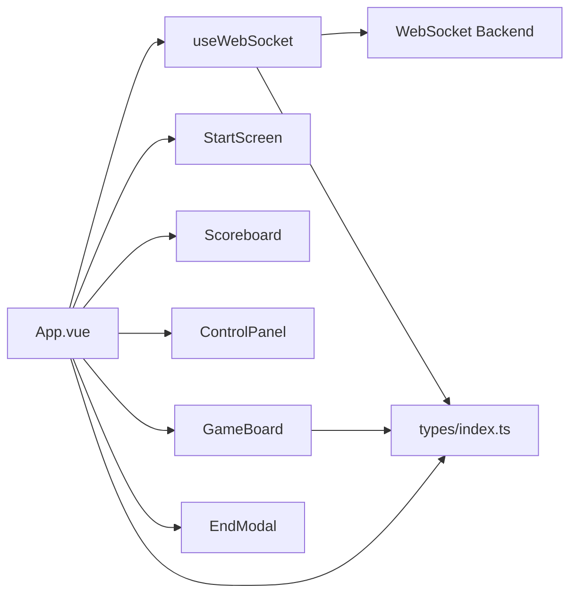
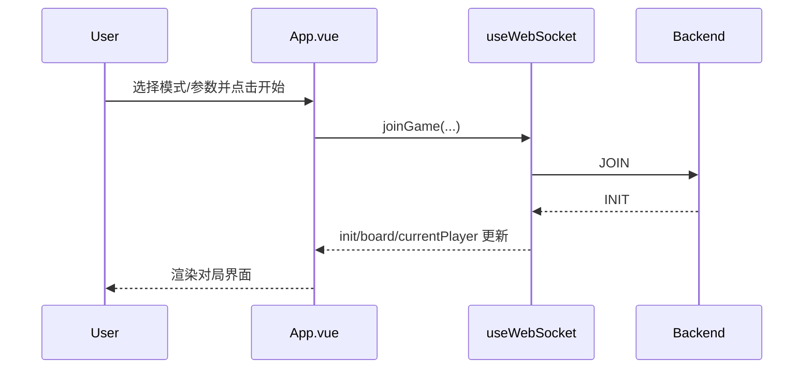
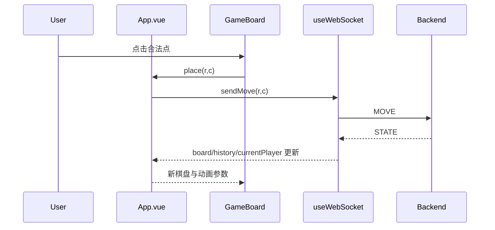
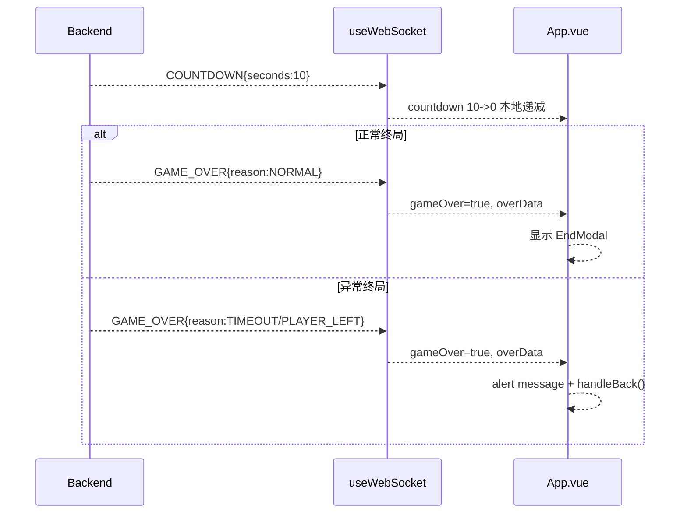

# Othello 前端程序设计书

## 1. 文档范围
本文档描述 `frontend`（Vue3 + TypeScript + Vite）实现，覆盖：
- 整体架构
- 模块构成（函数级）
- 模块关系与数据流
- WebSocket 通讯接口落地
- 通讯协议前端处理策略与电文实例
- 画面设计（布局、视觉、交互、状态反馈）

代码基线目录：`frontend/src`

---

## 2. 整体架构

前端采用 **单页应用（SPA）+ 组合式 API** 架构：
1. 入口层：`main.ts`
2. 页面编排层：`App.vue`
3. 网络状态层：`composable/useWebSocket.ts`
4. 展示组件层：`components/*`
5. 类型契约层：`types/index.ts`

关键原则：
- 状态单源：WS 数据集中在 `useWebSocket`。
- UI 解耦：组件以 `props + emits` 实现纯展示/交互。
- 协议对齐：所有消息类型由 `types` 约束。

---

## 3. 模块构成

### 3.1 `main.ts`（应用入口）
职责：
- 创建 Vue 应用并挂载根组件。

函数：
- `createApp(App).mount('#app')`

### 3.2 `types/index.ts`（协议与领域类型）
职责：
- 定义前端所有领域模型与 WS 电文数据结构。

核心类型：
- `Player = 0|1|2`
- `GameMode = 'PVE'|'PVP'|'PVP_ONLINE'`
- `Color = 'BLACK'|'WHITE'`
- `AILevel = 'easy'|'normal'|'hard'`

核心接口：
- `Position{r,c}`
- `MoveRecord{player,position,flipped,hintTag?}`
- `GameInitData`
  - 在线扩展：`online{pairCode,isHost,ready,isSpectator?,activeHint?}`
- `GameStateData`
- `AIMoveData`
- `HintResultData`
- `GameOverData{winner,blackScore,whiteScore,reason?,message?}`
- `WSMessage{type,data?}`

### 3.3 `composable/useWebSocket.ts`（网络与同步状态）
职责：
- 维护 WS 生命周期。
- 解析服务端电文并同步前端状态。
- 提供业务 API：`joinGame/sendMove/sendUndo/requestHint/leaveGame`。

导出状态：
- `status`
- `init`
- `board`
- `currentPlayer`
- `history`
- `gameOver`
- `overData`
- `passEvent`
- `flippedCells`
- `hintMove`
- `errorMessage`
- `countdown`

内部全局变量：
- `ws: WebSocket | null`
- `countdownTimer: number | null`

### 3.4 `App.vue`（页面编排与状态机）
职责：
- 挂接 `useWebSocket`。
- 组合 Start/Game/End 三阶段 UI。
- 承载模式逻辑（PVE/PVP/PVP_ONLINE + spectator）。
- 处理跨组件业务规则（提示、倒计时、返回、终局）。

本地 UI 状态：
- `gameStarted, gameMode, playerColor, aiColor, boardSize`
- `showHistory, showHint, isThinking, passShown`
- `lastMovePos, flippedCells`
- `aiAlgorithm, aiLevel, hintAlgorithm, hintLevel`
- `pairCode`

关键计算属性：
- `currentBoard, boardReady`
- `isOnlineMode, onlineReady, isOnlineSpectator`
- `moveLog`
- `isPlayerTurn`
- `canUndo`
- `onlineWaitingText, onlineCountdownText`
- `blackRole, whiteRole`

### 3.5 `components/StartScreen.vue`（开局配置页）
职责：
- 采集模式、执子、棋盘、算法、难度、在线配对码。
- 发出 `start` 事件。

### 3.6 `components/GameBoard.vue`（棋盘与记录）
职责：
- 渲染棋盘格、棋子、可落子点、提示点。
- 承载翻子动画。
- 内嵌对局记录侧栏。
- 观战模式支持合法点预览（`allowPreviewMoves`）。

### 3.7 `components/Scoreboard.vue`（计分面板）
职责：
- 基于 `board` 实时统计黑白子数。
- 高亮当前行棋方。

### 3.8 `components/ControlPanel.vue`（控制面板）
职责：
- 提供悔棋/记录/提示/返回控制。
- 提供提示算法与难度切换。
- 支持禁用提示（观战模式 `disableHint`）。

### 3.9 `components/EndModal.vue`（终局弹窗）
职责：
- 显示终局比分和胜方。
- 支持拖拽。
- 支持按钮文案配置（`actionText`：再来一局/返回）。

---

## 4. 模块关系



关系说明：
- `App.vue` 是唯一页面编排中心。
- `useWebSocket` 是网络状态单源。
- 子组件不直接访问 WS，仅经 `props/emits`。

---

## 5. 状态模型设计

### 5.1 全局状态来源
- 服务端权威状态：`board/currentPlayer/history/gameOver/...`
- 前端派生状态：`isPlayerTurn/canUndo/role 文案/countdown 展示`

### 5.2 关键状态约束
1. `isPlayerTurn`
- `PVE`: `currentPlayer===playerColor`
- `PVP`: 始终可操作（单端双执子）
- `PVP_ONLINE`: 观战者永远 false，玩家按颜色回合判断

2. `canUndo`
- 仅 PVE 可 true

3. `hintMove`
- `HINT_RESULT` 更新
- `STATE/AI_MOVE` 清空
- `INIT` 时可由 `online.activeHint` 恢复

4. `countdown`
- `COUNTDOWN` 启动本地 10->0 递减
- `STATE/AI_MOVE/GAME_OVER/leaveGame` 清零

---

## 6. 通讯接口前端落地

WS 地址解析：`resolveWsUrl()`
- 优先 `VITE_WS_URL`
- 否则根据当前 `location` + `VITE_BACKEND_PORT` 拼接

连接生命周期：
1. `connect()` 建立连接并监听 `onmessage`。
2. `joinGame()` 会先断旧连接，再建新连接，确保新局隔离。
3. `leaveGame()` 主动关闭连接并清理倒计时。

发送接口：
- `sendMove(r,c)`
- `sendUndo()`
- `requestHint(algorithm, level)`

---

## 7. 通讯协议处理（前端视角）

消息处理函数：`handleServerMessage(msg)`

- `INIT`：初始化对局状态，恢复 `activeHint`。
- `STATE`：更新棋盘/历史/回合，清空当前提示点。
- `COUNTDOWN`：启动本地递减倒计时。
- `AI_MOVE`：更新 AI 落子结果。
- `HINT_RESULT`：更新红点提示。
- `GAME_OVER`：置终局并停止倒计时。
- `ERROR`：写入 `errorMessage`（UI层可选择静默处理）。

---

## 8. 模式行为设计

### 8.1 PVE
- 玩家回合可落子。
- AI 回合显示“思考中”。
- 支持悔棋。

### 8.2 PVP（本地）
- 单客户端双人轮流操作。
- 可显示提示和历史。

### 8.3 PVP_ONLINE
- 配对码入场。
- 主客文案区分。
- 50s 触发 10 秒倒计时提示。
- 超时/退出自动结束。

### 8.4 Spectator（观战）
- 不可落子、不触发提示请求。
- 可看合法点预览（当前行棋方）与历史。
- 可接收当前行棋方提示广播。
- 终局显示胜负弹窗，按钮为“返回”。

---

## 9. 组件函数级设计

### 9.1 `StartScreen.vue`

状态：
- `mode, color, size, aiAlgorithm, aiLevel, pairCode`

函数：
- `handleStart()`
  - 在线模式校验 `pairCode` 为 4 位数字。
  - 发出 `start(...)`。

### 9.2 `GameBoard.vue`

输入：
- `board/currentPlayer/showHint/showHistory/isPlayerTurn/allowPreviewMoves/lastMove/flippedCells/hintMove/historyEntries`

状态：
- `animatingFlips:Set<string>`
- `historyListRef`
- `clearFlipTimer`

函数：
- `cellAt`：安全取格子值。
- `isFlipped`：翻子动画判定。
- `isValidMove`：是否合法点。
- `isBestMove`：是否提示点。
- `handleClick`：触发 `place`（需可操作且合法）。
- `colLabel`：列号 A/B/C...
- `getFlipsForHint`：前端合法点计算。

监听：
- `flippedCells`：触发 420ms 翻子动画。
- `historyEntries.length`：记录面板自动滚到底。

### 9.3 `ControlPanel.vue`

输入：
- `canUndo, gameOver, showHistory, showHint, hintAlgorithm, hintLevel, disableHint`

输出事件：
- `undo/toggleHistory/toggleHint/back/hintAlgorithmChange/hintLevelChange`

规则：
- `disableHint=true` 时禁用提示按钮并隐藏配置。

### 9.4 `Scoreboard.vue`

函数：
- `blackScore`：遍历棋盘统计黑子数。
- `whiteScore`：遍历棋盘统计白子数。

### 9.5 `EndModal.vue`

输入：
- `overData, actionText?`

计算：
- `message`：胜负文案。
- `actionText`：按钮文案兜底“再来一局”。

交互函数：
- `setDefaultPosition`、`clampPosition`
- `startDrag/handleDrag/endDrag`
- `startDragMouse/startDragTouch`
- `onMouseMove/onTouchMove/onResize`

生命周期：
- `onMounted` 注册拖拽和 resize 监听。
- `onBeforeUnmount` 清理监听。

### 9.6 `App.vue`

关键函数：
- `handleStart(...)`：进入对局并发起 `JOIN`。
- `handlePlace(r,c)`：玩家落子。
- `handleUndo()`：PVE 悔棋。
- `toggleHint()/changeHintAlgorithm()/changeHintLevel()`：提示控制。
- `handleBack()`：退出对局回主界面并重连 WS。
- `handleRestart()`：重开当前配置。
- `coord(r,c)`：坐标格式化（A1/B2）。

关键监听：
- `passEvent`：临时显示“跳过”。
- `wsCurrentPlayer`：更新思考状态与自动请求提示。
- `errorMessage`：仅在非对局期弹窗，避免阻塞渲染。
- `wsGameOver`：在线异常终局自动回主页；正常终局显示弹窗。
- `init`：在线模式按 `selfColor` 修正本地执子。
- `wsBoard/wsFlippedCells`：收敛动画状态。

---

## 10. 画面设计

### 10.1 画面清单
1. 启动配置页（StartScreen）
2. 对局主界面（Scoreboard + 状态条 + 左侧面板 + 棋盘）
3. 终局弹窗（EndModal）

### 10.2 布局设计

总体：
- 页面采用固定画布策略（`min-width:1200px`），小窗口横向滚动。
- 主体容器 `game-shell` 居中、卡片式背景。

对局区：
- 两列网格：
  - 左列 `280px`：对弈双方 + 控制面板
  - 右列：棋盘及可展开记录

棋盘：
- 动态 cell 尺寸随棋盘大小变化：
  - 6x6：64px
  - 8x8：52px
  - 10x10：42px
- 历史展开时右侧留出记录区域宽度。

### 10.3 视觉规范

配色：
- 背景：深蓝/墨绿径向渐变（营造棋盘氛围）
- 棋盘：绿色系渐变（对比黑白棋子）
- 交互按钮：薄荷绿渐变

层级：
- 页面背景 > `game-shell` > 棋盘/面板 > 棋子/提示点 > 弹窗

文本：
- 标题高对比、状态文案居中。
- 历史记录采用白/浅绿区分黑白落子行。

### 10.4 动效设计

- 棋子翻转：`flip` 动画（约 350ms）。
- 提示红点：`pulse` 呼吸动画（1.2s 循环）。
- 按钮 hover：轻微上浮与亮度变化。
- 历史记录：新增自动滚到底。

### 10.5 交互设计

启动页：
- 模式/执子/棋盘/算法采用 pill 选中态。
- 在线配对码必须 4 位数字。
- WS 未连接前禁用“开始游戏”。

对局页：
- 当前回合高亮、状态栏提示。
- 观战模式下提示按钮禁用，仍可看合法点。
- 在线倒计时区分“你/对手”。

终局：
- 正常终局：弹窗显示比分与胜方。
- 按角色显示动作：玩家“再来一局”/观战“返回”。
- 异常终局（超时/退出）自动回主界面。

### 10.6 可用性与容错

- 棋盘加载前显示 `Loading board...` 占位。
- WS 错误在对局中不阻塞渲染（避免 alert 抢占）。
- 倒计时在状态推进后及时清理，防止残留。

---

## 11. 前端时序图（按消息顺序）

### 11.1 启动到开局



### 11.2 对局推进



### 11.3 在线倒计时与终局



---

## 12. 协议电文实例（前端消费）

### 12.1 INIT（观战中途进入，含 activeHint）
```json
{
  "type":"INIT",
  "data":{
    "gameId":"abc",
    "currentPlayer":2,
    "selfColor":0,
    "history":[],
    "online":{"pairCode":"1234","isSpectator":true,"ready":true,"activeHint":{"r":5,"c":4}}
  }
}
```

### 12.2 STATE（落子）
```json
{
  "type":"STATE",
  "data":{
    "currentPlayer":1,
    "lastMove":{"r":2,"c":3},
    "flipped":[{"r":3,"c":3}],
    "history":[{"player":2,"position":{"r":2,"c":3},"flipped":[{"r":3,"c":3}]}]
  }
}
```

### 12.3 COUNTDOWN
```json
{"type":"COUNTDOWN","data":{"seconds":10}}
```

### 12.4 HINT_RESULT（广播给观战）
```json
{
  "type":"HINT_RESULT",
  "data":{
    "position":{"r":5,"c":4},
    "algorithm":{"name":"增强博弈","code":"abx"},
    "level":"normal"
  }
}
```

### 12.5 GAME_OVER
```json
{"type":"GAME_OVER","data":{"winner":"BLACK","blackScore":36,"whiteScore":28,"reason":"NORMAL"}}
```

### 12.6 ERROR（只读观战）
```json
{"type":"ERROR","data":{"message":"Spectator mode is read-only"}}
```

---

## 13. 扩展建议

1. 将 `App.vue` 大量模式分支迁移到独立 `gameStore`（Pinia）降低编排复杂度。
2. 将棋盘合法点计算与翻子动画参数抽到 `useBoardLogic` composable。
3. 增加协议版本号（如 `data.version`）提升前后端升级兼容性。
4. 引入非阻塞 Toast 统一替代 `alert`（异常终局提示也统一样式）。
5. 为关键计算属性和 `useWebSocket` 增加 Vitest 单测。
