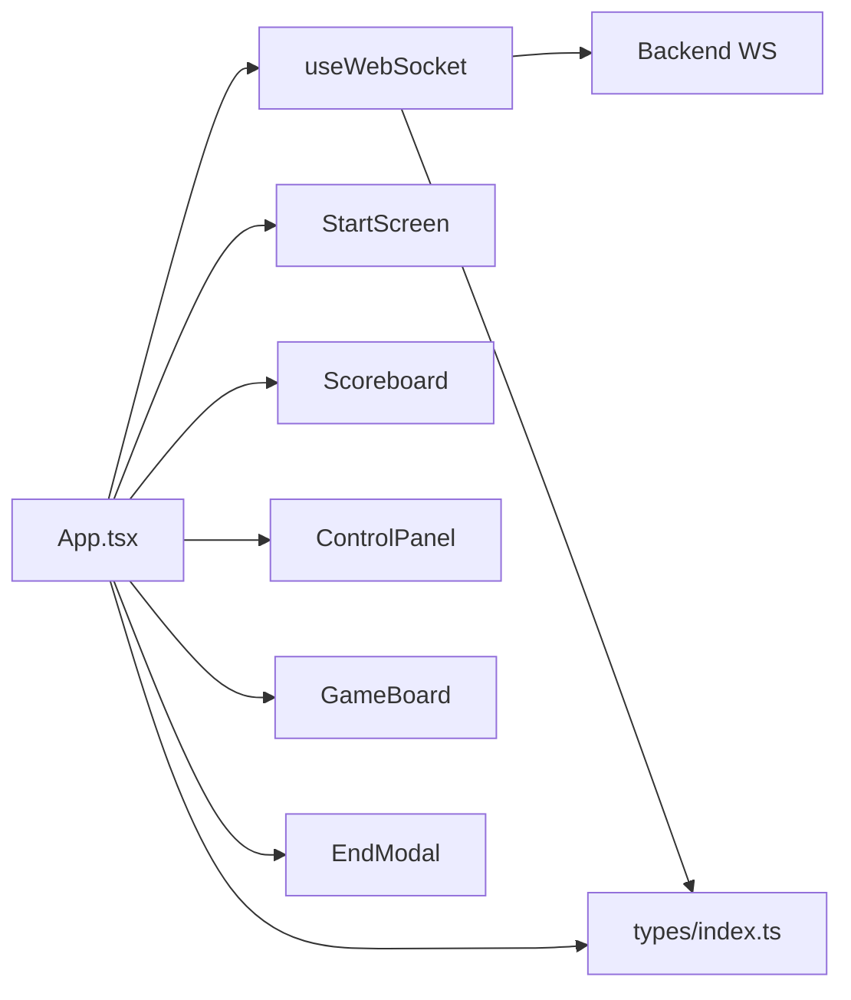
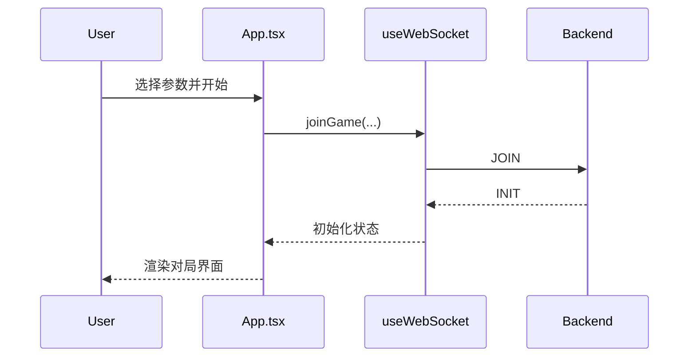
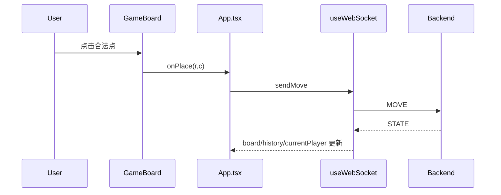
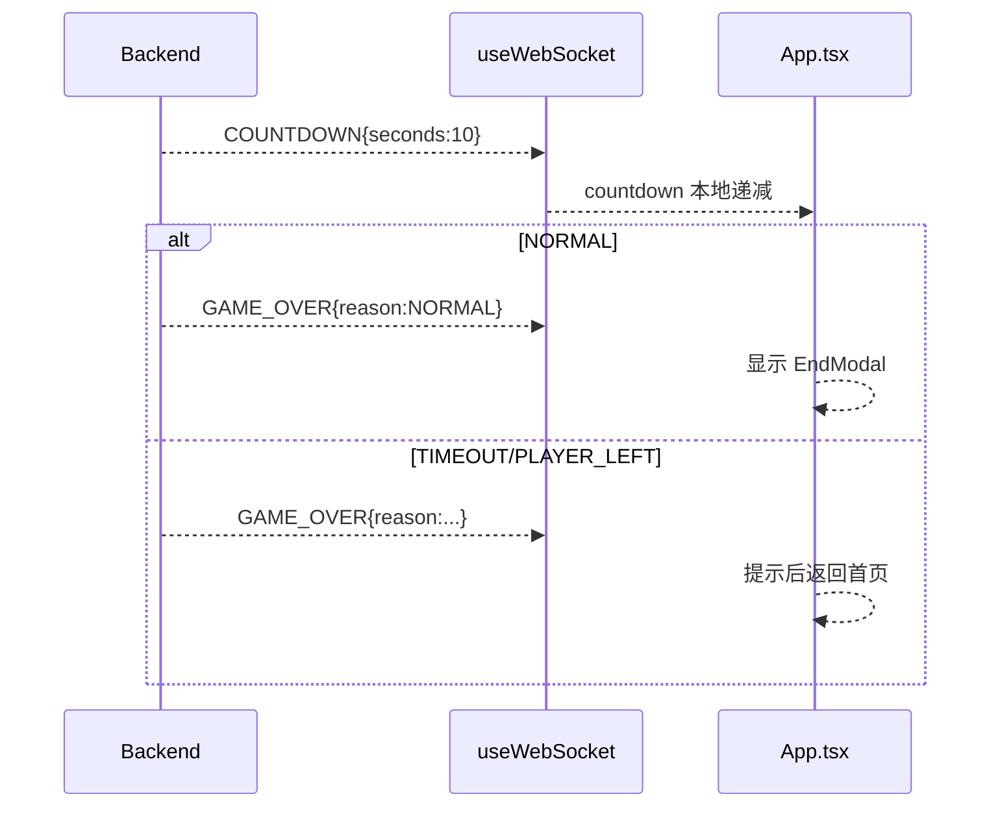

# Othello 前端程序设计书（React 版）

## 1. 文档范围
本文档描述 `frontend_rct`（React + TypeScript + Vite）实现，覆盖：
- 整体架构
- 模块构成（函数级）
- 模块关系与数据流
- WebSocket 通讯接口落地
- 通讯协议处理与电文实例
- 画面设计（布局/视觉/交互）

代码目录：`frontend_rct/src`

---

## 2. 整体架构

前端采用 **SPA + Hooks** 架构：
1. 入口层：`main.tsx`
2. 页面编排层：`App.tsx`
3. 网络状态层：`hooks/useWebSocket.ts`
4. 组件层：`components/*`
5. 类型契约层：`types/index.ts`

设计原则：
- 网络状态集中：`useWebSocket` 是协议状态单源。
- 页面编排清晰：`App.tsx` 只处理流程与业务规则。
- 展示组件纯净：组件通过 `props + 回调` 工作。

---

## 3. 模块构成

### 3.1 `main.tsx`
职责：
- 创建 React Root。
- 挂载 `App`。
- 注入全局样式 `styles.css`。

### 3.2 `types/index.ts`
职责：
- 定义领域类型与通讯协议模型。

核心类型：
- `Player` / `GameMode` / `Color` / `AILevel`
- `Position` / `MoveRecord`
- `GameInitData`（含 online 扩展：`isSpectator`、`activeHint`）
- `GameStateData` / `AIMoveData` / `HintResultData`
- `GameOverData` / `WSMessage` / `ConnectionStatus`

### 3.3 `hooks/useWebSocket.ts`
职责：
- 管理 WS 连接生命周期。
- 解析服务端消息并更新前端状态。
- 提供发送接口与连接控制函数。

导出状态：
- `status/init/board/currentPlayer/history`
- `gameOver/overData/passEvent/flippedCells`
- `hintMove/errorMessage/countdown`

导出方法：
- `connect/joinGame/sendMove/sendUndo/requestHint/reconnect/leaveGame`
- `setErrorMessage`（用于 UI 层消费后清理错误提示）

内部关键变量：
- `wsRef`: 当前 WebSocket
- `countdownTimerRef`: 倒计时定时器

### 3.4 `App.tsx`
职责：
- 页面级状态机（开始页 -> 对局页 -> 终局弹窗）。
- 模式路由逻辑：`PVE/PVP/PVP_ONLINE` 与观战。
- 协调提示、倒计时、终局回退。

关键本地状态：
- 对局控制：`gameStarted/gameMode/playerColor/aiColor/boardSize`
- UI 控制：`showHistory/showHint/isThinking/passShown`
- 临时数据：`lastMovePos/flippedCells/pairCode`
- 算法配置：`aiAlgorithm/aiLevel/hintAlgorithm/hintLevel`

关键计算：
- `isPlayerTurn/canUndo/isOnlineSpectator`
- `onlineWaitingText/onlineCountdownText`
- `blackRole/whiteRole/moveLog`

### 3.5 `components/StartScreen.tsx`
职责：
- 采集开局参数。
- 在线模式配对码校验（4 位数字）。
- 触发 `onStart`。

### 3.6 `components/GameBoard.tsx`
职责：
- 渲染棋盘、棋子、坐标、提示点。
- 计算可落子点（含观战预览）。
- 翻子动画与记录侧栏滚动。

### 3.7 `components/Scoreboard.tsx`
职责：
- 统计并显示黑白子数量。
- 高亮当前行棋方。

### 3.8 `components/ControlPanel.tsx`
职责：
- 悔棋/提示/记录/返回操作。
- 提示算法与难度切换。
- 观战可禁用提示（`disableHint`）。

### 3.9 `components/EndModal.tsx`
职责：
- 显示胜负信息。
- 提供拖拽交互。
- 动作按钮文案可配置（再来一局/返回）。

---

## 4. 模块关系



---

## 5. 状态与流程设计

### 5.1 状态单源
- 服务端权威状态由 `useWebSocket` 持有。
- 页面层只做派生计算与展示决策。

### 5.2 模式规则
1. `PVE`
- 玩家与 AI 轮转。
- 可悔棋。

2. `PVP`
- 本地双人轮流（单端双执子）。

3. `PVP_ONLINE`
- 主客玩家按颜色权限落子。
- 观战者只读。

### 5.3 提示请求去重
为避免 `HINT_RESULT` 触发重复请求，`App.tsx` 使用 `lastAutoHintKeyRef`，仅在以下上下文变化时请求一次提示：
- 当前行棋方变化
- 提示算法变化
- 提示难度变化

---

## 6. 通讯接口（前端落地）

WS 地址解析：
- 优先 `VITE_WS_URL`
- 否则按当前协议 + 主机 + `VITE_BACKEND_PORT` 计算

连接控制：
- `connect()`：建连
- `joinGame()`：断旧连 -> 建新连 -> 发送 JOIN
- `leaveGame()`：主动断连并清理倒计时

发送消息：
- `MOVE`
- `UNDO`
- `HINT`

---

## 7. 协议处理（消息分发）

`handleServerMessage(msg)` 分发：
- `INIT`：初始化对局状态；恢复 `activeHint`
- `STATE`：更新棋盘/历史/回合；清空提示红点
- `COUNTDOWN`：启动本地 10->0 倒计时
- `AI_MOVE`：更新 AI 落子结果
- `HINT_RESULT`：更新提示红点
- `GAME_OVER`：设置终局并停止倒计时
- `ERROR`：写入 `errorMessage`

UI 错误策略：
- 对局中不弹阻塞式 `alert`，防止影响渲染顺序。

---

## 8. 组件函数级设计

### 8.1 `StartScreen`
- `handleStart()`：
  - 在线模式先校验配对码
  - 参数透传 `onStart`

### 8.2 `GameBoard`
- `validMovesSet`：合法落点集合
- `cellAt()`：安全取值
- `isFlipped()`：翻子动画判定
- `isValidMove()`：合法落点判定
- `isBestMove()`：提示点判定
- `handleClick()`：可落子时回调 `onPlace`
- `getFlipsForHint()`：纯前端规则计算

监听逻辑：
- `flippedCells` -> 启动 420ms 翻子动画
- `historyEntries.length` -> 记录列表滚动到底

### 8.3 `ControlPanel`
- 按钮回调透传
- `disableHint` 时禁用提示按钮并隐藏配置

### 8.4 `Scoreboard`
- 双重遍历 `board` 统计黑白子

### 8.5 `EndModal`
- `clampPosition()`：拖拽边界限制
- `onMouseDown/onMove/onUp`：拖拽流程
- `message`：胜负文案计算

### 8.6 `App`
核心函数：
- `handleStart/handlePlace/handleUndo/toggleHint/handleBack/handleRestart`
- `coord(r,c)` 坐标格式化

关键副作用：
- 初次 `connect`
- `passEvent` 短时提示
- 回合变化时 AI 思考文案
- 在线异常终局自动回主界面
- `init.selfColor` 修正本地执子

---

## 9. 画面设计

### 9.1 页面结构
1. 启动配置页（StartScreen）
2. 对局页（Scoreboard + 状态条 + 左侧面板 + 棋盘）
3. 终局弹窗（EndModal）

### 9.2 布局
- 固定画布：`min-width: 1200px`
- 主体两列：
  - 左列：`280px`（双方信息 + 控制面板）
  - 右列：棋盘（可展开记录）

### 9.3 样式方向
- 深色背景 + 蓝绿渐变氛围
- 绿色棋盘与高对比黑白子
- 轻量发光与卡片阴影增强层次

### 9.4 交互与动画
- 翻子动画：`flip`（350ms）
- 提示点动画：`pulse`（1.2s）
- 按钮 hover：轻微位移/亮度提升
- 终局弹窗：可拖拽

### 9.5 观战视觉规则
- 双方文案不显示“你/对手”
- 提示按钮禁用
- 可见合法落点与当前提示红点
- 正常终局显示胜负弹窗，按钮为“返回”

---

## 10. 时序图（前端视角）

### 10.1 开局


### 10.2 落子推进


### 10.3 在线倒计时与终局


---

## 11. 协议电文实例

### 11.1 在线观战 INIT
```json
{
  "type":"INIT",
  "data":{
    "selfColor":0,
    "online":{"pairCode":"1234","isSpectator":true,"ready":true,"activeHint":{"r":5,"c":4}}
  }
}
```

### 11.2 STATE
```json
{
  "type":"STATE",
  "data":{
    "currentPlayer":2,
    "lastMove":{"r":2,"c":3},
    "flipped":[{"r":3,"c":3}],
    "history":[{"player":1,"position":{"r":2,"c":3},"flipped":[{"r":3,"c":3}]}]
  }
}
```

### 11.3 HINT_RESULT
```json
{
  "type":"HINT_RESULT",
  "data":{
    "position":{"r":5,"c":4},
    "algorithm":{"name":"增强博弈","code":"abx"},
    "level":"normal"
  }
}
```

### 11.4 GAME_OVER
```json
{
  "type":"GAME_OVER",
  "data":{"winner":"BLACK","blackScore":36,"whiteScore":28,"reason":"NORMAL"}
}
```

---

## 12. 扩展建议

1. 引入 `react-router` 区分开始页/对局页路由，提升可维护性。
2. 用 `zustand` 或 `redux-toolkit` 统一复杂状态，降低 `App.tsx` 体量。
3. 将棋盘规则计算抽成 `useBoardLogic`，便于单元测试。
4. 统一提示系统（Toast）替代 `alert`，避免阻塞渲染。
5. 增加协议回归测试（Mock WS）覆盖 online/观战关键路径。
